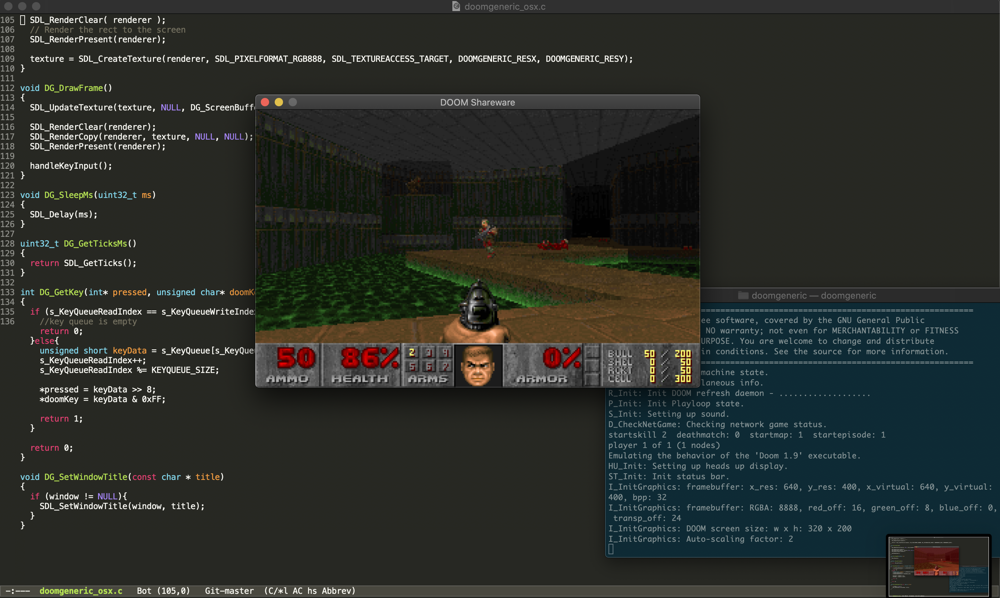

# doomgeneric
The purpose of doomgeneric is to make porting Doom easier.
Of course Doom is already portable but with doomgeneric it is possible with just a few functions.

To try it you will need a WAD file (game data). If you don't own the game, shareware version is freely available (doom1.wad).

# porting
Include `doomgeneric.h` into your source file and just implement these functions to suit your platform.
* DG_Init
* DG_GetWads
* DG_DrawFrame
* DG_SleepMs
* DG_GetTicksMs
* DG_GetKey
* DG_SetWindowTitle
* DG_OpenSaveGameReader
* DG_OpenSaveGameWriter
* DG_DemoRecorded
* DG_PCXScreenshotTaken

|Functions            |Description|
|---------------------|-----------|
|DG_Init              |Initialize your platfrom (create window, framebuffer, etc...).
|DG_GetWads           |Provide all game data
|DG_DrawFrame         |Frame is ready in DG_ScreenBuffer. Copy it to your platform's screen.
|DG_SleepMs           |Sleep in milliseconds.
|DG_GetTicksMs        |The ticks passed since launch in milliseconds.
|DG_GetKey            |Provide keyboard events.
|DG_SetWindowTitle    |Not required to do anything. This is for setting the window title as Doom sets this from WAD file.
|DG_OpenSaveGameReader|Provide an interface to read the save game data from a specific save slot, return NULL if no save data exists in this slot.
|DG_OpenSaveGameWriter|Provide an interface to write save game data to a specific save slot.
|DG_DemoRecorded      |Respond to the user having recording a demo.
|DG_PCXScreenshotTaken|Respond to the user having taken a screenshot.

### main loop
At start, call `doomgeneric_Create()`.

In a loop, call `doomgeneric_Tick()`.

In simplest form:
```
int main(int argc, char **argv)
{
    doomgeneric_Create(argc, argv);

    while (1)
    {
        doomgeneric_Tick();
    }

    return 0;
}
```

# sound
Sound is much harder to implement! If you need sound, take a look at SDL port. It fully supports sound and music! Where to start? Define FEATURE_SOUND, assign `DG_sound_module` and `DG_music_module`.

# platforms
One ported platform, SDL, is provided as an example.

## SDL

